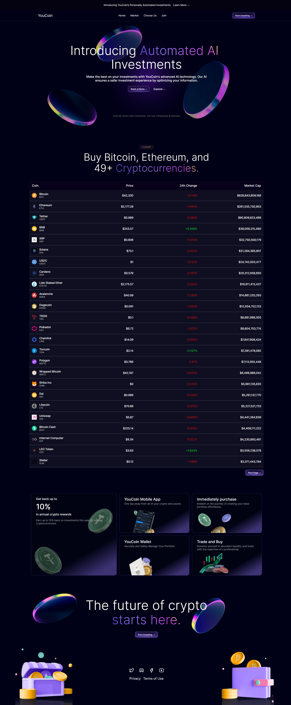
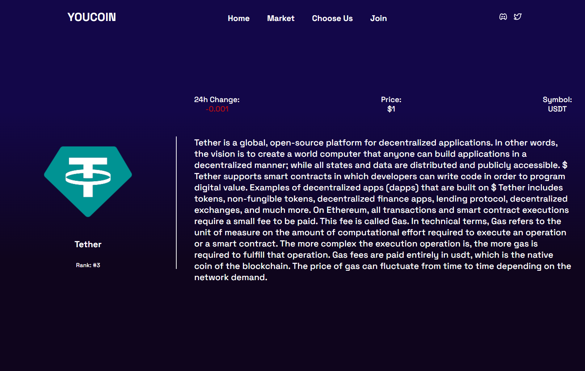

<h2>About the project</h2>

<b>YouCoin</b> serves as a real-time Crypto Market where users can access information about diverse cryptocurrencies. The platform leverages the Coingecko API as its primary data source for cryptocurrency information.  

Coingecko provides details on various cryptocurrencies, including their current value, historical price records, trading volume, market capitalization, and other key metrics. By integrating this API, CoinYou ensures that users receive timely updates on the latest cryptocurrency prices and market trends.

👉 Live Demo: <a href='https://youcoin.vercel.app'>YouCoin Demo</a>

<h3>Built using:</h3>

» React JS  
» CSS  
» HTML 
» Coingecko API  

 

<h2>Project Screenshots</h2>
 
<h3 align='center'>Home Page 🏢</h3>

  

  

<h3 align='center'>Coin Page 🪙</h3>

  

